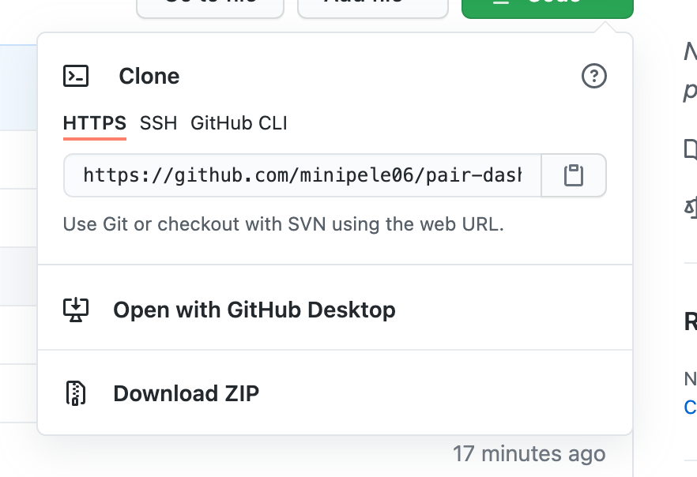
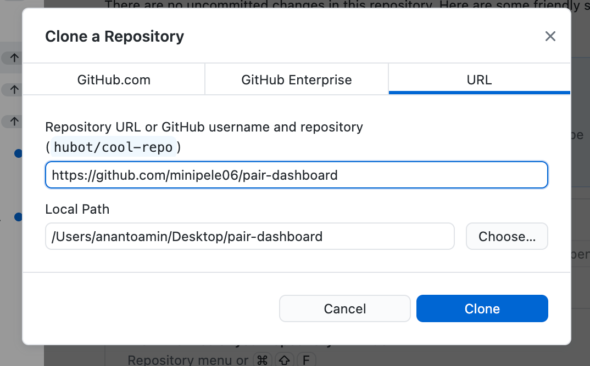
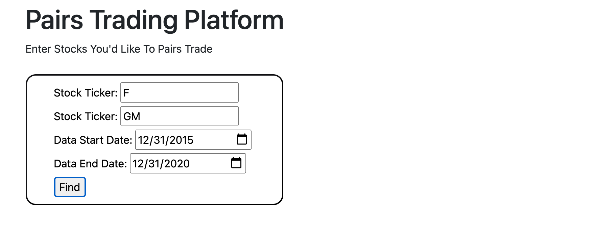
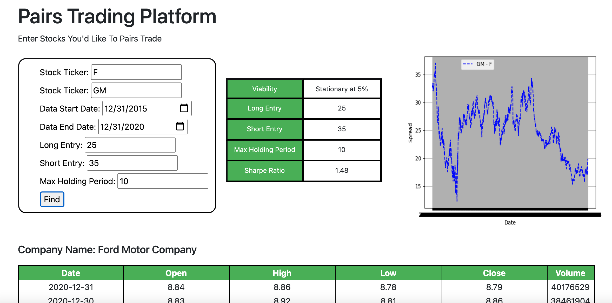

# pair-dashboard
 
 ## Functionality

This web app allows you to search research different pairs of stocks and see their viability as well as testing different strategies on a given pair:

* Check viability by conducting stationarity test
* Test different entry thresholds and holding periods 
* View Sharpe ratios
* View graph of spreads
* View price data in tables

## Setup

### Repo Setup
Use [GitHub](https://github.com/minipele06/pair-dashboard) to clone the project repository for the Pairs Trading Dashboard. Use GitHub Desktop software or the command-line to download or "clone" it onto your computer. 

You will be prompted to choose a local path to save the repository. Choose a familiar download location like the Desktop. An example would be to save to a local path such as /Desktop/pairs-dashboard. 

After cloning the repo, navigate there from the command-line:

>cd ~/Desktop/pairs-dashboard

### Environment Setup

If you have never or don't have Conda installed, please visit the following page and follow the instructions: https://conda.io/projects/conda/en/latest/user-guide/install/index.html

Once you have installed, create and activate a new Anaconda virtual environment:

>conda create -n robo-env python=3.7 # (first time only)

>conda activate robo-env

From within the virtual environment, install the required packages specified in the "requirements.txt" file:

>pip install -r requirements.txt

## Instructions
From within the virtual environment, confirm your ability to run the web app from the command-line:

Mac
>FLASK_APP=web_app flask run

PC
>export FLASK_APP=web_app # first time, to set the env var
>flask run # subsequent times

If you receive a message stating the following:

>Running on http://127.0.0.1:5000/ (Press CTRL+C to quit)

Then you have succesfully launched the web app. Go to you internet browser and enter the following adress to access the app locally http://127.0.0.1:5000/. 

## Step-by-Step Guide

As stated above, once you receive a message in your terminal that the web app is running locally, you may then navigate to the local address.

### Price Find

The Pairs Dashboard page is the main landing page where you can perform all of the functionality of the web app. This page allows you to search for two stock tickers at a time.

There is some validation upon the inputs. The stock ticker is checked that it includes 1-5 letters by utilizing regex. The dates are checked so that the start date is not after the end date and that either date is not in the future. The data will be pulled from the Alphavantage API.

Here are some examples of the output:

Example 1

Example 2

## Implemented Trading Strategy

Using this dashboard, I tried many different stock pairs but landed on a pair trading strategy between Ford (F) and General Motors (GM). The long entry threshold that I settled upon is 25 and a short entry threshold of 35 with the maximum hold period of 10 days. Looking at data from 2016 to 2020, this strategy has a historical Sharpe ratio of 1.48. 

## Future Developments

The following program was created as a minimum viable product and therefore is missing some functionality. Some of said missing functionality include:

* Adding SQL database connection to load prices and securities for future pulls
* Log searches to keep track of researched trading strategies
* Ability to track performance of strategies
* Ability for users to create a watchlist